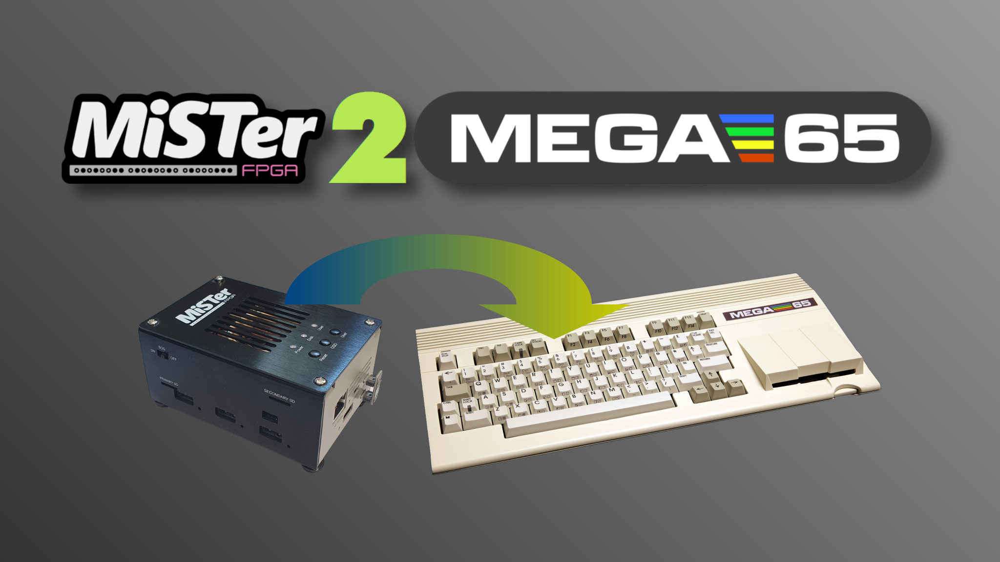

MiSTer2MEGA65
=============

MiSTer2MEGA65 is a framework to simplify porting MiSTer cores to the MEGA65.

Learn more by
[watching this YouTube video](https://youtu.be/9Ib7z64z9N4)
and get started by reading the
[MiSTer2MEGA65 Wiki](https://github.com/sy2002/MiSTer2MEGA65/wiki).

TL;DR
-----

1. Scroll up and press the "Use this template" button to start a new
   MiSTer2MEGA65 project. Then fork the MiSTer core you want to port
   and make it a Git submodule of your newly created project.

2. Wrap the MiSTer core inside `CORE/vhdl/main.vhd` while
   adjusting the clocks in `CORE/vhdl/clk.vhd`. Provide RAMs, ROMs and other
   devices in `CORE/vhdl/mega65.vhd` and wire everything correctly.

3. Configure your core's behavior, including how the start screen looks like,
   what ROMs should be loaded (and where to), the abilities of the
   <kbd>Help</kbd> menu and more in `CORE/vhdl/config.vhd` and in
   `CORE/vhdl/globals.vhd`.

**DONE** your core is ported to MEGA65! :-)

*Obviously, this is a shameless exaggeration of how easy it is to work with
MiSTer2MEGA65, but you get the gist of it.*

Getting started, detailed documentation and support
---------------------------------------------------

* Please visit our official
  [MiSTer2MEGA65 Wiki](https://github.com/sy2002/MiSTer2MEGA65/wiki). It
  contains everything you ever wanted to know about M2M, including a
  "Getting Started" tutorial and a step-by-step guide to port a MiSTer core.
  You might whant to start your journey
  [here](https://github.com/sy2002/MiSTer2MEGA65/wiki/1.-What-is-MiSTer2MEGA65)
  and then follow the reading track that is pointed out in the
  respective chapters.

* Post a question in our
  [Discussion Forum](https://github.com/sy2002/MiSTer2MEGA65/discussions).

Progress
--------

CAUTION: RIGHT NOW THIS STILL IS A WORK-IN-PROGRESS VERSION.

Yet, there is already one successful project live and up and
running that is based on this version of the M2M framework:
The [C64 for MEGA65](https://github.com/MJoergen/C64MEGA65).

M2M is not officially released at this moment:

It is somewhere between an Alpha and a Beta version. We try
to keep the M2M architecture as stable as possible from now
on so that you can rely on it and start porting MiSTer cores.
